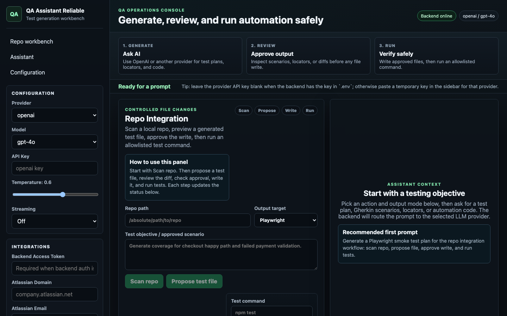

# QA Assistant Playwright

QA Assistant Playwright is a local-first AI workbench for turning QA context into practical test assets. It can read direct prompts, Jira tickets, JQL/Rovo search results, DOM snippets, and repository scans, then generate test plans, locators, Gherkin scenarios, Playwright/Selenium/Cypress skeletons, Page Object Models, and API test plans.

The project is intentionally semi-autonomous. It can propose files and run allowlisted commands, but it requires explicit user approval before writing generated test files into a repository.

## What It Does

- Generates structured QA output from natural-language prompts.
- Supports multiple LLM providers: OpenAI, Gemini, Claude/Anthropic, DeepSeek, Mistral, Kimi, Groq, and local Ollama.
- Uses server-side `.env` keys or temporary per-provider keys from the UI.
- Distills DOM/HTML into safer locator-generation context.
- Scores locator stability and prefers role, label, `data-testid`, `id`, then CSS.
- Converts Jira ticket context into test scenarios and automation skeletons.
- Scans a local repo, proposes a test file, shows a diff, writes only after approval, and runs an allowlisted test command.
- Exports generated content as native test files, Markdown, or CSV.

## Architecture

```text
qa-assistant-reliable/
  backend/                 FastAPI API, LLM routing, repo integration, security
  frontend/                React + Vite UI
  tests/                   Backend tests and Playwright smoke test
  api/index.py             Deployment entrypoint for ASGI hosts
  requirements.txt         Pinned Python dependencies
  package.json             Root scripts for backend/frontend/e2e tests
```

### Backend

The backend is FastAPI. Important modules:

- `backend/server.py`: API routes, request validation, auth gate, streaming endpoint.
- `backend/logic.py`: real provider adapters for OpenAI, Gemini, Claude, DeepSeek, Mistral, Kimi, Groq, and Ollama.
- `backend/dom_distiller.py`: DOM cleanup, URL safety checks, SSRF protection.
- `backend/repo_integration.py`: repo scanning, generated file proposals, approved writes, allowlisted test commands.
- `backend/atlassian.py`: Jira issue and JQL helpers.
- `backend/security.py`: optional backend access token.

### Frontend

The frontend is React + Vite. The UI is organized around a visible QA pipeline:

1. Generate with an LLM provider.
2. Review scenarios, locators, or proposed files.
3. Approve writes explicitly.
4. Run allowlisted tests and inspect output.

## LLM Providers

| Provider | Key / setup | Notes |
| --- | --- | --- |
| OpenAI | `OPENAI_API_KEY` | Validated end-to-end with backend `.env` key fallback. |
| Gemini | `GEMINI_API_KEY` | Supports text and vision through Google Generative AI SDK. |
| Claude | `ANTHROPIC_API_KEY` | Supports text and vision through Anthropic SDK. |
| DeepSeek | `DEEPSEEK_API_KEY` | OpenAI-compatible API. |
| Mistral | `MISTRAL_API_KEY` | OpenAI-compatible API. |
| Kimi | `KIMI_API_KEY` | Moonshot OpenAI-compatible API. |
| Groq | `GROQ_API_KEY` | OpenAI-compatible API. |
| Ollama | local `ollama serve` | Uses `http://localhost:11434` by default. |

You can either put provider keys in `.env` or paste a temporary key in the UI sidebar. The UI key is sent to the backend for that request only and stored in browser localStorage.

## Environment

Copy the example file and add only the keys you need:

```bash
cp .env.example .env
```

Common local configuration:

```bash
OPENAI_API_KEY=your-openai-api-key-here
QA_ASSISTANT_VERIFY_SSL=true
QA_ASSISTANT_ALLOWED_REPO_ROOTS=/Users/you/projects
QA_ASSISTANT_REPO_COMMAND_TIMEOUT_SECONDS=60
```

Optional backend auth:

```bash
QA_ASSISTANT_ACCESS_TOKEN=choose-a-private-token
```

When `QA_ASSISTANT_ACCESS_TOKEN` is set, the frontend must send the same value as `X-Backend-Token`. The UI has a field for this in the sidebar.

## Security Notes

- `.env` and `.env.*` are ignored by Git.
- Never commit real provider keys.
- Repo writes require explicit approval from the UI.
- Repo operations are restricted by `QA_ASSISTANT_ALLOWED_REPO_ROOTS`.
- Test execution is allowlisted and time-limited.
- URL fetching is restricted to public `http`/`https`, blocks private IP ranges, limits redirects, and caps response size.
- `QA_ASSISTANT_VERIFY_SSL=false` exists only for trusted corporate proxy environments.

## Install

Requirements:

- Python 3.11+
- Node.js 20+
- npm

Create a Python virtual environment:

```bash
python3 -m venv .venv
.venv/bin/python -m pip install -r requirements.txt
```

Install Node dependencies:

```bash
npm install
cd frontend
npm install
cd ..
```

## Run Locally

Start the backend:

```bash
.venv/bin/python -m uvicorn backend.server:app --reload --host 127.0.0.1 --port 8010
```

Start the frontend:

```bash
cd frontend
QA_API_TARGET=http://127.0.0.1:8010 npm run dev -- --host 127.0.0.1 --port 5181
```

Open:

```text
http://127.0.0.1:5181
```

## Screenshot



## Example Prompt

Use OpenAI or another configured provider, choose `Gherkin scenarios`, and send:

```text
Generate one smoke scenario for validating that the QA assistant opens, shows the repo integration panel, and has a chat input.
```

For repo integration, use a prompt like:

```text
Generate a Playwright smoke test for the QA assistant workflow: open the app, verify the repo integration panel is visible, verify the chat input exists, and verify output mode selection is available.
```

## Repo Integration Workflow

1. Enter an absolute repo path.
2. Choose an output target, such as Playwright.
3. Describe the approved testing objective.
4. Click `Scan repo`.
5. Click `Propose test file`.
6. Review the generated diff.
7. Check the approval box.
8. Click `Write approved file`.
9. Run an allowlisted command such as `npm test`.

The app never silently modifies your repo.

## Tests

Run backend and frontend unit tests:

```bash
npm test
```

Run only backend tests:

```bash
npm run test:backend
```

Run only frontend tests:

```bash
npm run test:frontend
```

Run the Playwright smoke test against a running frontend:

```bash
PLAYWRIGHT_BASE_URL=http://127.0.0.1:5181 npm run test:e2e
```

Current validation status before publishing:

- Backend tests: 16 passed.
- Frontend unit tests: 17 passed.
- Playwright smoke test: 1 passed.
- OpenAI backend `.env` key fallback: validated through the UI.

## Continuous Integration

GitHub Actions runs Ruff, backend tests, frontend linting and unit tests, and the
Playwright smoke test on every push and pull request. The end-to-end job starts
the backend and frontend locally; it does not require a provider API key.

## Deployment Modes

### Private Local

Recommended for personal use. Run both servers on `127.0.0.1`, keep provider keys in `.env`, and restrict repo roots.

### Private LAN / Team

Set `QA_ASSISTANT_ACCESS_TOKEN`, use HTTPS behind a trusted proxy, and keep allowed repo roots narrow.

### Public

Do not expose this app publicly without real authentication, rate limiting, secret management, audit logging, and careful repo sandboxing.

## Git Hygiene

Before pushing:

```bash
git status --short
git check-ignore .env
```

Expected:

- `.env` should be ignored.
- `.venv/`, `node_modules/`, `frontend/node_modules/`, `test-results/`, and build output should not be committed.

## License

No license has been selected yet. Add one before publishing if you want others to use or modify this project under explicit terms.
